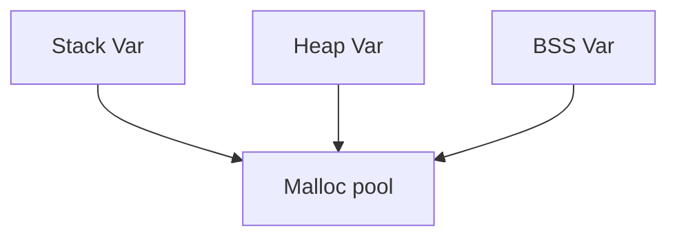

Write a simple GC for C programming language.
======

# Design Overview
This is a simple GC which just works. To put it easily, what GC does is to free 
memory which is not used anymore. The _memory_ here means heap memory created by
_malloc_. The memory which is not in use means that there is no reference to it
in the program. We have to do three things:

- Get all the memory created(owned) by malloc.
- Walk through all of them and see if there is any reference to it.
- If there is no reference to a chunk of memory, just free it.

We will break the whole design into two parts: (1) memory allocation (2) GC

# Part one: Memory allocation
_malloc_ requests memory from the system kernel using `sbrk` or `mmap` system calls.
When user calls _malloc_ for memory, _malloc_ first checks if there are enough memory
in the the pool it manages. If the pool does not have enough memory, _malloc_ will 
make a system call to request more from the kernel.

The memory pool which _malloc_ manages can be designed in various ways. A simple one
used here is a circular linked list.

# Part two: GC
There are three main memory areas in a program: heap, stack and BSS. If the variables
in those areas points to the memory owned by _malloc_, that chunk of memory is in use.

## GC_init
TODO

## GC_malloc
GC_malloc is the API provided to the users for memory allocation. See `Part one` for detail.

## GC_collect
TODO